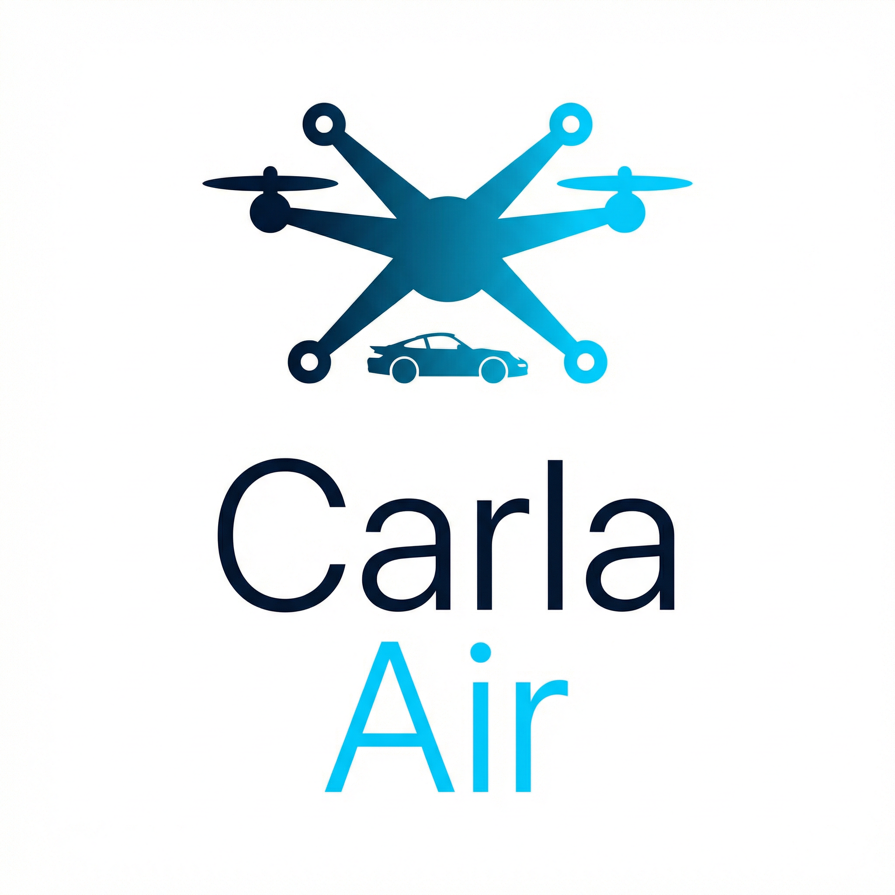

# CarlaAir

<p align="center">
  
</p>

<p align="center">
  
</p>

> **CarlaAir**: A unified air-ground simulation platform integrating CARLA and AirSim.

[English](README.md) | [中文](README_CN.md)

**Air-Ground Co-Simulation Platform** built on CARLA 0.9.16 + AirSim, providing unified FPS drone control, realistic urban traffic, and dual-API access in a single Unreal Engine 4.26 instance.

---

## Features

- **Unified Simulation** — CARLA ground simulation (vehicles, pedestrians, weather, sensors) and AirSim aerial simulation (multirotor drone, cameras) run in one UE4 process
- **FPS Drone Control** — Fly a drone with WASD + mouse in the 3D viewport, with adjustable speed via scroll wheel
- **Physics Collision** — UE4 native Sweep-based collision; drone stops on impact with buildings and terrain
- **Auto Traffic** — 30 vehicles + 50 pedestrians auto-spawned on startup for realistic urban scenarios
- **Dual API** — CARLA Python API (port 2000) + AirSim Python API (port 41451), both accessible simultaneously
- **Weather System** — Cycle through weather presets (clear, rain, fog, night) with N key
- **24 Example Scripts** — Ready-to-run demos for aerial surveillance, city tours, data collection, trajectory recording, and more

## System Requirements

| Component | Minimum |
|-----------|---------|
| OS | Ubuntu 20.04 / 22.04 |
| CPU | Intel i7 9th gen or AMD Ryzen 7 |
| RAM | 32 GB |
| GPU | NVIDIA RTX 3070 (8 GB VRAM) |
| Disk | 100 GB free (source build) / 30 GB (binary) |
| Driver | NVIDIA 525+ with Vulkan support |

## Quick Start

### Option A: Binary Release (recommended)

```bash
# Download and extract CarlaAir-v0.1.6
tar xzf CarlaAir-v0.1.6.tar.gz
cd CarlaAir-v0.1.6

# Launch (auto-spawns traffic)
./CarlaAir.sh

# In another terminal — test connection
python3 -c "import carla; c=carla.Client('localhost',2000); print(c.get_world().get_map().name)"
python3 -c "import airsim; c=airsim.MultirotorClient(port=41451); c.confirmConnection()"
```

### Option B: Build from Source

```bash
# 1. Clone UE4 (CARLA fork)
git clone --depth 1 -b carla https://github.com/CarlaUnreal/UnrealEngine.git ~/carla_ue4
cd ~/carla_ue4 && ./Setup.sh && ./GenerateProjectFiles.sh && make

# 2. Clone CarlaAir source
git clone <this-repo> ~/carla_source
cd ~/carla_source

# 3. Build dependencies
./Util/BuildTools/Setup.sh
./Util/BuildTools/BuildLibCarla.sh
./Util/BuildTools/BuildPythonAPI.sh
./Util/BuildTools/BuildCarlaUE4.sh --build

# 4. Launch in Editor mode
./carlaAir.sh
```

See [BUILD_GUIDE.md](CarlaAir_Release/source/BUILD_GUIDE.md) for detailed instructions.

## Controls

| Key | Action |
|-----|--------|
| W / A / S / D | Move forward / left / back / right |
| Space / Shift | Fly up / down |
| Mouse | Yaw (turn left/right) |
| Scroll Wheel | Adjust drone speed |
| N | Cycle weather presets |
| P | Toggle physics / invincible mode |
| H | Show/hide help overlay |
| Tab | Toggle mouse capture |

## Architecture

```
┌──────────────────────────────────────────────────────┐
│                 Unreal Engine 4.26                    │
│  ┌────────────────────────────────────────────────┐  │
│  │          ASimWorldGameMode (core)              │  │
│  │  ┌──────────────────┐ ┌─────────────────────┐ │  │
│  │  │  CARLA Subsystem  │ │  AirSim Subsystem   │ │  │
│  │  │  - Episode        │ │  - SimModeBase      │ │  │
│  │  │  - Weather        │ │  - HUD Widget       │ │  │
│  │  │  - TrafficManager │ │  - Physics Engine   │ │  │
│  │  │  - RPC :2000      │ │  - RPC :41451       │ │  │
│  │  └──────────────────┘ └─────────────────────┘ │  │
│  └────────────────────────────────────────────────┘  │
└──────────────────────────────────────────────────────┘
        │                          │
        ▼                          ▼
  CARLA Python API          AirSim Python API
  (port 2000)               (port 41451)
```

## Example Scripts

| Script | Description |
|--------|-------------|
| `fly_drone_keyboard.py` | Interactive keyboard drone control |
| `demo_drive_and_fly.py` | Simultaneous ground vehicle + drone demo |
| `demo_flight_city.py` | Automated city flyover |
| `aerial_surveillance.py` | Drone surveillance with camera capture |
| `city_tour.py` | Guided city tour route |
| `data_collector.py` | Multi-sensor data collection |
| `drone_car_chase.py` | Drone tracking a ground vehicle |
| `drone_traj_col.py` | Drone trajectory recording |
| `drone_traj_playback.py` | Trajectory replay |
| `showcase_traffic.py` | Traffic visualization demo |

See the full list in [`examples/`](examples/).

## Project Structure

```
CarlaAir/
├── carlaAir.sh              # Editor mode launcher
├── auto_traffic.py          # Auto traffic generator
├── Unreal/CarlaUE4/         # UE4 project + plugins
│   └── Plugins/
│       ├── AirSim/          # AirSim plugin (drone, HUD, physics)
│       └── Carla/           # CARLA plugin (traffic, sensors, RPC)
├── PythonAPI/               # Python client libraries
├── LibCarla/                # C++ client library
├── examples/                # Example scripts (24)
├── test_script/             # Test scripts
├── CarlaAir_Release/        # Release documentation
│   ├── guide/               # Quick-Start, FAQ
│   ├── install/             # Binary installation guide
│   └── source/              # Source build guide, architecture
├── Content/Blueprints/      # Custom UE4 blueprints
├── Util/BuildTools/         # Build toolchain
└── Progress_record/         # Development notes
```

## Documentation

- [Quick Start Guide](CarlaAir_Release/guide/Quick-Start.md)
- [FAQ](CarlaAir_Release/guide/FAQ.md)
- [Architecture](CarlaAir_Release/source/ARCHITECTURE.md)
- [Build Guide](CarlaAir_Release/source/BUILD_GUIDE.md)
- [Modifications from upstream CARLA](CarlaAir_Release/source/MODIFICATIONS.md)
- [CHANGELOG](CHANGELOG.md)

## License

CARLA specific code is distributed under MIT License. CARLA specific assets are distributed under CC-BY License. AirSim is distributed under MIT License.

See [LICENSE](LICENSE) for details.

## Acknowledgments

CarlaAir builds on:
- [CARLA](https://github.com/carla-simulator/carla) — Open-source autonomous driving simulator
- [AirSim](https://github.com/microsoft/AirSim) — Open-source robotics simulation platform by Microsoft
- [Unreal Engine 4.26](https://www.unrealengine.com/) — Epic Games
